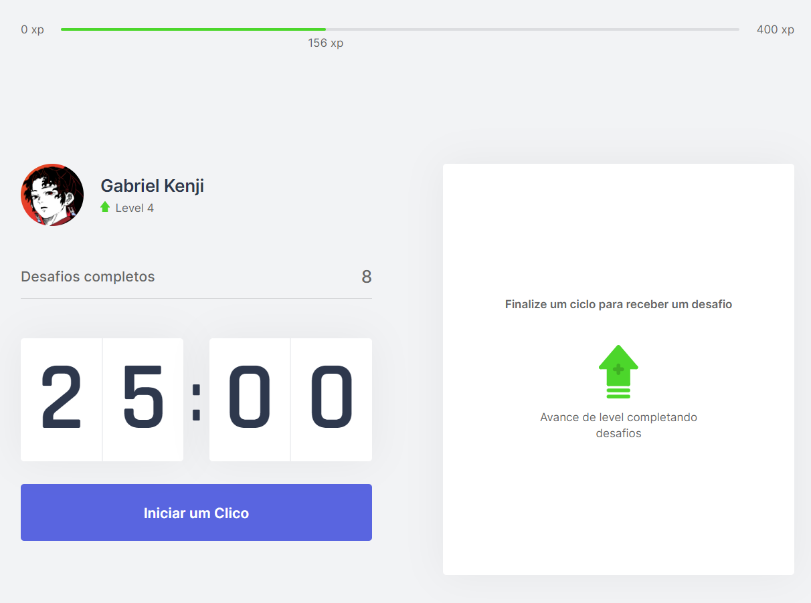
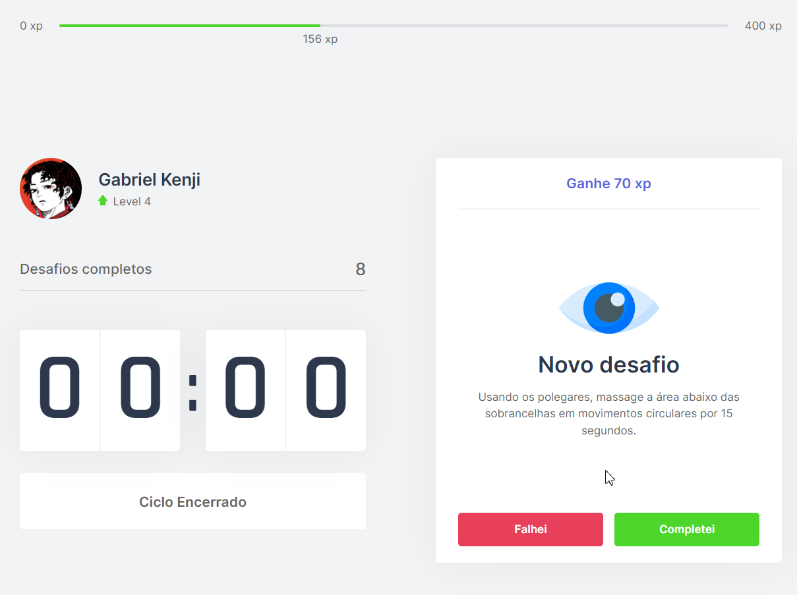
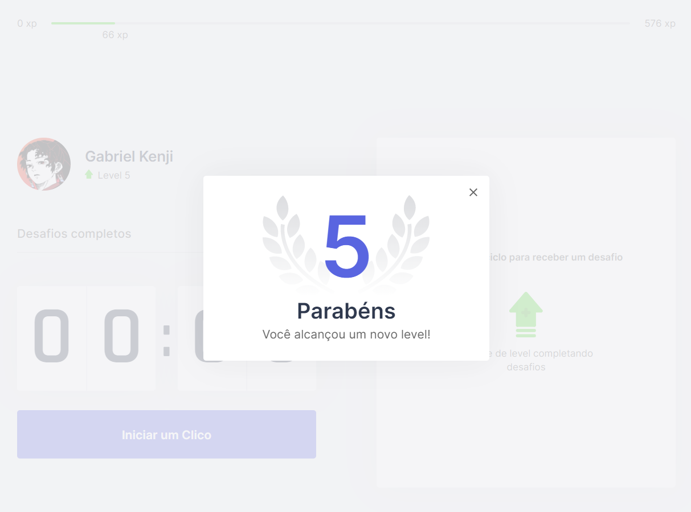

<p align="center">
   
</p>

<div align="center">
 <a href="#projeto">Projeto</a> •
 <a href="#tecnologias">Tecnologias Utilizadas</a> •
 <a href="#execucao">Como Executar</a> •
 <a href="#construcao">Em Construção</a> •
 <a href="#licenca">Licença</a> •
 <a href="#autor">Autor</a> •
 <a href="#contato">Contato</a>
</div>

---

# :fire: <Strong> Obrigado por visualizar este repositório </Strong> 

<p align="justify"> Olá, primeiramente me chamo Gabriel Kenji Poli Ozaki, tenho 21 anos e trabalho na área de Desenvolvedor Front-end. </p>

<p align="justify"> Para mais informações sobre mim, acesse o README em meu perfil do GITHUB.</p>

## :computer: <strong id="projeto">Sobre o Projeto </strong>




<p align="justify">O <strong>Move.it</strong> é uma aplicação que une a <strong><a href="https://www.napratica.org.br/pomodoro/">técnica de Pomodoro</a></strong> com a realização de atividade física, ou seja, para quem passa muito tempo na frente do computador nunca se esquecer de cuidar da sua saúde.</p>

<p align="justify">Essa aplicação Move.it foi desenvolvida, através de um evento gratuito feito pela empresa Rocketseat.</p>

### :pushpin: Funcionalidades

- [x] Iniciar o temporizador
- [x] Apresentar o desafio.
- [x] Contabilizar o XP, Level e Total de Desafios Completos (somente caso o desafio for concluído)

### :triangular_ruler: Layout

<p>Você pode visualizar o layout do projeto, através desse<a href="https://www.figma.com/file/ge20pu3ofMOKoliUyKx1Nl/Move.it-1.0"> link</a>. É necessário ter conta no <a href="https://www.figma.com/">Figma</a> para acessá-lo.</p>

## :rocket: <Strong id="tecnologias"> Tecnologias Utilizadas </Strong>

[](https://nextjs.org/) [](https://www.typescriptlang.org/) [](https://developer.mozilla.org/pt-BR/docs/Web/CSS)

## :runner: <strong id="execucao"> Como executar o projeto </strong>

[](https://classic.yarnpkg.com/en/docs/install/#windows-stable)

```bash
# Fazer o clone do Repositório.
>> git clone https://github.com/WD-GabrielKenji/NLW4-MoveIt.git
>> cd NLW4-MoveIt >> code .
```

```bash
# Para executar a aplicação é necessário:

## Instalar as dependências:
>> yarn
## Iniciar o servidor de desenvolvimento:
>> yarn dev
```

<pre>
>> Acessar <a href="http://localhost:3000" rel="nofollow"><code>localhost:3000</code></a> no seu Browser, e usufruir da aplicação!
</pre>

## :construction: <strong id="construcao"> Em construção </strong>

Funcionalidades que ainda estão sendo preparadas para serem incrementadas:

<ul>
    <li> Responsividade </li>
    <li> Tema Dark </li>
    <li> Adaptação para Mobile </li>
    <li> Score de leaderboards </li>
    <li> Funcionalidade PWA </li>
</ul>

## :closed_book: <strong id="licenca"> Licença </strong>


Esse projeto está sob a licença MIT. Veja o arquivo [LICENSE](LICENSE) para mais detalhes.

## :boy: <strong id="autor"> Autor </strong>

<a href="https://github.com/WD-GabrielKenji" title="Perfil Github">
  
  <br />
  <sub><b>Gabriel Kenji Poli Ozaki</b></sub> :star2: 
</a>

Feito de ❤️ por <strong>Gabriel Kenji Poli Ozaki</strong> - <strong>Desenvolvedor Front-end</strong> 👋🏽

### :mailbox_with_mail: <strong id="contato"> Redes Sociais para Contato: </strong>

<p> Entre em contato, através destas redes sociais: </p>

[](https://www.linkedin.com/in/wdkenji/) :boom: [](https://www.instagram.com/biel.kenjii/) :boom: [](mailto:g.kenjijs@gmail.com)

[](https://github.com/WD-GabrielKenji)